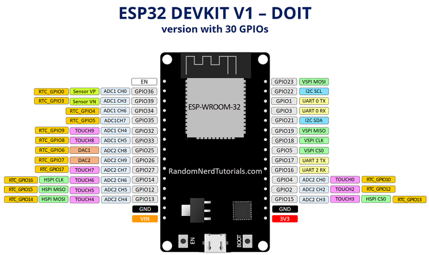
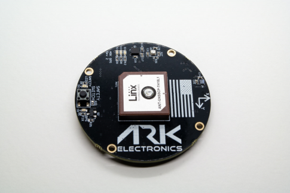
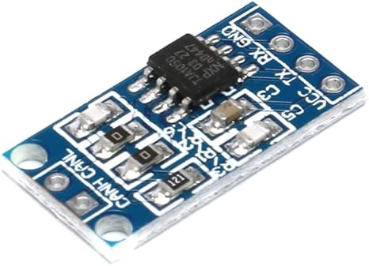
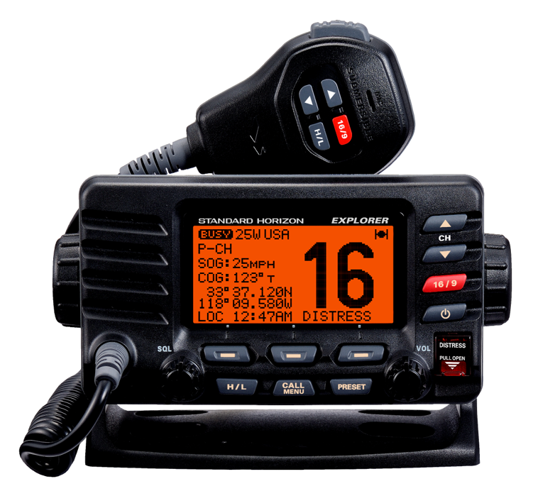
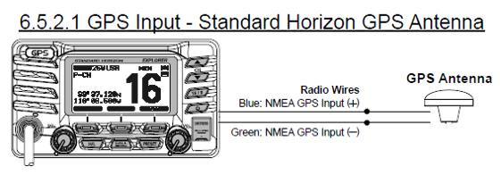

# DroneCAN-to-NMEA Bridge

Bridges an [ARK GPS](https://arkelectron.com/product/ark-gps/) module (speaking DroneCAN at 1 Mbps) to NMEA 0183 consumers over both wired RS485 serial and WiFi simultaneously. The ESP32 participates as a full DroneCAN node on the bus (heartbeat, dynamic node ID allocation).

```
ARK GPS ──CAN bus──> ESP32 ──RS485 serial──> Standard Horizon GX1600 VHF
  (DroneCAN)           │                       (4800 baud NMEA 0183)
                       │
                       └──WiFi TCP/UDP──> iPad / Raspberry Pi (OpenPlotter)
                                           (port 10110)
```

## Hardware Requirements

| Component | Notes |
|---|---|
| ESP32 DEVKIT V1 DOIT (30-pin) | Target board |
| [ARK GPS](https://arkelectron.com/product/ark-gps/) (Ublox M9N + BMM150 + BMP388 + ICM-42688-P) | DroneCAN source -- GPS, magnetometer, barometer, IMU |
| TJA1050 CAN Bus Transceiver | CAN-to-UART level conversion. **Must be powered at 5V** (see [Troubleshooting](#troubleshooting)) |
| TTL-to-RS485 converter module | UART2 to differential serial for the VHF radio |
| Standard Horizon GX1600 VHF | Wired NMEA consumer (GPS DATA IN port) |
| iPad | WiFi TCP/UDP NMEA consumer (Navionics, iSailor, etc.) |
| Raspberry Pi / OpenPlotter | WiFi TCP NMEA consumer |

## Pin Assignments / Wiring

| Signal | GPIO |
|---|---|
| CAN TX -> TJA1050 TX | GPIO 5 |
| CAN RX <- TJA1050 RX | GPIO 4 |
| UART2 TX -> RS485 module DI | GPIO 17 |
| UART2 RX <- RS485 module RO | GPIO 16 |
| RS485 DE/RE enable (HIGH = transmit) | GPIO 18 |
| Status LED | GPIO 2 (onboard) |

> TJA1050 module pin labels (TX/RX) are from the MCU's perspective: ESP32 GPIO 5 (TX) goes to the module's TX pin, GPIO 4 (RX) goes to the module's RX pin.

> A **120-ohm termination resistor** is required at each end of the CAN bus, even for a two-device setup at 1 Mbps. The ARK GPS has a spare CAN port that can be used for the termination resistor.

### Hardware Photos

| ESP32 DEVKIT V1 DOIT | ARK GPS | TJA1050 |
|---|---|---|
|  |  |  |

| GX1600 VHF Radio | GPS DATA IN Port |
|---|---|
|  |  |

### ARK GPS Sensors

- Ublox M9N GPS
- Bosch BMM150 Magnetometer
- Bosch BMP388 Barometer
- Invensense ICM-42688-P 6-Axis IMU

## Quick Start

1. **Wire the hardware** per the pin assignments above. Power the TJA1050 at **5V** (not 3.3V). Install 120-ohm termination resistors on both ends of the CAN bus.
2. **Install [PlatformIO](https://platformio.org/)** (CLI or VS Code extension).
3. **Clone the repo:**
   ```bash
   git clone https://github.com/Spenda4life/DroneCAN-to-NMEA.git
   cd DroneCAN-to-NMEA
   ```
4. **Build and flash:**
   ```bash
   pio run -t upload
   ```
   libcanard is fetched automatically on first build.
5. **Connect a WiFi client** to the `ESP32-GPS` access point (password: `dronecan1`).
6. **Verify NMEA output:**
   ```bash
   # From a machine connected to the ESP32-GPS WiFi:
   nc 192.168.4.1 10110
   ```
   You should see NMEA sentences (`$GPRMC`, `$GPGGA`, etc.) streaming at 5 Hz.
7. **Wired serial:** Connect the RS485 output to the GX1600 GPS DATA IN port. The radio should acquire a GPS fix within seconds.

### LED Status Indicators

| Pattern | Meaning |
|---|---|
| Solid ON | CAN active, GPS fix valid |
| 1 Hz blink | WiFi up, waiting for CAN data |
| 3 Hz blink | CAN active, no GPS fix |
| SOS pattern | CAN bus-off error (check wiring/power) |

## Configuration

All tunables live in [`src/config.h`](src/config.h). Edit this file before building.

### WiFi

| Setting | Default | Description |
|---|---|---|
| `WIFI_AP_SSID` | `"ESP32-GPS"` | Access point SSID |
| `WIFI_AP_PASS` | `"dronecan1"` | Access point password |
| `WIFI_TCP_PORT` | `10110` | TCP/UDP port (IANA assigned for NMEA-0183) |
| `WIFI_UDP_BROADCAST` | (flag) | Enable UDP broadcast to 255.255.255.255 for auto-discovery by apps |

If saved STA (station) credentials exist in NVS, the ESP32 will attempt to join that network first (10s timeout) before falling back to AP mode.

### Serial / RS485

| Setting | Default | Description |
|---|---|---|
| `SERIAL_BAUD` | `4800` | Baud rate for RS485 output (GX1600 expects 4800) |

### DroneCAN

| Setting | Default | Description |
|---|---|---|
| `DRONECAN_NODE_ID` | `100` | ESP32 node ID on the CAN bus (1-127) |
| `DRONECAN_ALLOC_NODE_ID` | `42` | Node ID assigned to the ARK GPS via dynamic allocation |

### NMEA Sentence Selection

Enable or disable individual sentence types:

| Flag | Default | Sentence | Notes |
|---|---|---|---|
| `EMIT_RMC` | `true` | `$GPRMC` | Required by GX1600 |
| `EMIT_GGA` | `true` | `$GPGGA` | Required by OpenPlotter |
| `EMIT_VTG` | `true` | `$GPVTG` | Velocity/track |
| `EMIT_HDM` | `true` | `$HCHDM` | Magnetic heading (requires magnetometer) |
| `EMIT_GSA` | `true` | `$GPGSA` | DOP and active satellites |
| `EMIT_XDR_BARO` | `false` | `$IIXDR` | Barometric pressure (Phase 2) |
| `EMIT_XDR_TEMP` | `false` | `$IIXDR` | Air temperature (Phase 2) |

### Output Rates

| Setting | Default | Description |
|---|---|---|
| `GPS_OUTPUT_HZ` | `5` | RMC/GGA/VTG output rate |
| `HDM_OUTPUT_HZ` | `10` | Magnetic heading output rate |
| `AUX_OUTPUT_HZ` | `1` | GSA/XDR output rate |

### AHRS

| Setting | Default | Description |
|---|---|---|
| `AHRS_TILT_COMP` | `true` | Use accelerometer data for tilt-compensated magnetic heading |
| `IMU_STALE_MS` | `1000` | Fall back to raw magnetometer heading if no IMU data within this window |

## Build & Flash

This project uses **PlatformIO** with the Arduino framework targeting `esp32doit-devkit-v1`.

```bash
# Build only
pio run

# Build and flash via USB
pio run -t upload

# Monitor serial output
pio device monitor
```

## Usage

### OpenPlotter (Raspberry Pi)

Add a **TCP Client** input in OpenPlotter's Signal K / NMEA0183 input panel:
- Host: `192.168.4.1` (ESP32 AP address)
- Port: `10110`

### iPad Chart Apps

Connect to the `ESP32-GPS` WiFi network. Apps that support NMEA over TCP (e.g. Navionics, iSailor) can connect to `192.168.4.1:10110`. Apps that support UDP will auto-discover the stream via broadcast on port 10110.

### Standard Horizon GX1600

Wire the RS485 output to the radio's GPS DATA IN port. The radio expects 4800 baud NMEA by default. The `$GPRMC` sentence is the minimum required for the radio to acquire position.

## Testing

92 automated tests across native (PC) and embedded (ESP32) environments covering NMEA generation, DSDL decoding, CAN driver, multi-frame reassembly, and heartbeat broadcasting.

```bash
# Native tests -- no hardware needed, runs on host PC
pio test -e native

# Embedded tests -- requires ESP32 connected via USB
pio test -e test_embedded

# Full build verification (all environments + native tests)
bash scripts/verify_build.sh
```

### Test Suites

| Suite | Environment | Tests | What it covers |
|---|---|---|---|
| `test_nmea/` | Native (PC) | 47 | NMEA sentence generation, checksums, coordinate conversion, all sentence builders |
| `test_dsdl/` | Embedded (ESP32) | 31 | DSDL bit-level decoding for Fix2, Auxiliary, Mag, Pressure, Temperature, RawIMU |
| `test_multiframe/` | Embedded (ESP32) | 3 | Multi-frame CAN transfer reassembly and CRC validation |
| `test_can_driver/` | Embedded (ESP32) | 8 | TWAI loopback TX/RX and alert handling |
| `test_heartbeat/` | Embedded (ESP32) | 3 | NodeStatus broadcast format and transfer ID sequencing |

A manual hardware integration checklist is in [`test/HARDWARE_TEST_PROCEDURE.md`](test/HARDWARE_TEST_PROCEDURE.md).

## Troubleshooting

### ESP32 immediately enters CAN bus-off on boot
The TJA1050 **must be powered at 5V**, not 3.3V. At 3.3V the transceiver cannot drive the bus properly and will immediately error out.

### No data from ARK GPS
- Verify 120-ohm termination resistors are present at both ends of the CAN bus.
- Check that CAN TX/RX wiring matches the pin table (TJA1050 labels are MCU-perspective).
- The ARK GPS uses dynamic node ID allocation. The ESP32 acts as the allocator -- monitor serial output to confirm the handshake completes.

### NMEA consumers not receiving data
- Check that the WiFi client is connected to `ESP32-GPS` and can reach `192.168.4.1`.
- Test with `nc 192.168.4.1 10110` to confirm raw NMEA output.
- For the GX1600: verify RS485 wiring and that baud rate matches (default 4800).

### GPS fix takes a long time / no fix
- The ARK GPS needs clear sky visibility. First fix can take 30+ seconds from cold start.
- Check the LED: 3 Hz blink means CAN is active but no GPS fix yet.
- A solid LED means fix is valid and NMEA sentences contain live position data.

### LED shows SOS pattern
CAN bus-off error. Check:
1. TJA1050 is powered at 5V
2. Termination resistors are installed
3. CAN wiring is correct (TX to TX, RX to RX on the TJA1050 module)

### Sentences rejected by downstream device
NMEA checksums must be correct or receivers silently discard the sentence. Run the native tests (`pio test -e native`) to verify checksum logic. If tests pass, use a serial monitor to capture raw output and validate with an online NMEA checksum tool.

## Resources

- [ARK GPS Product Page](https://arkelectron.com/product/ark-gps/)
- [ARK GPS GitHub (DSDL, schematics)](https://github.com/ARK-Electronics/ARK_GPS)
- [DroneCAN Specification](https://dronecan.github.io/)
- [libcanard (legacy-v0 branch)](https://github.com/dronecan/libcanard)
- [pydronecan](https://github.com/dronecan/pydronecan)
- [OpenPlotter Documentation](https://openplotter.readthedocs.io)
- [NMEA 0183 Standard](https://www.nmea.org/content/STANDARDS/NMEA_0183_Standard)
- [IANA Port 10110 (NMEA-0183 over IP)](https://www.iana.org/assignments/service-names-port-numbers)

## License

See [LICENSE](LICENSE) for details.
